# Life Decision Coach (LDC) - Architecture Flowcharts

> [!NOTE]
> This document contains comprehensive flowcharts for the entire LDC system architecture. Each layer is visualized with detailed component interactions and data flows.

---

## 1. Complete System Architecture Overview

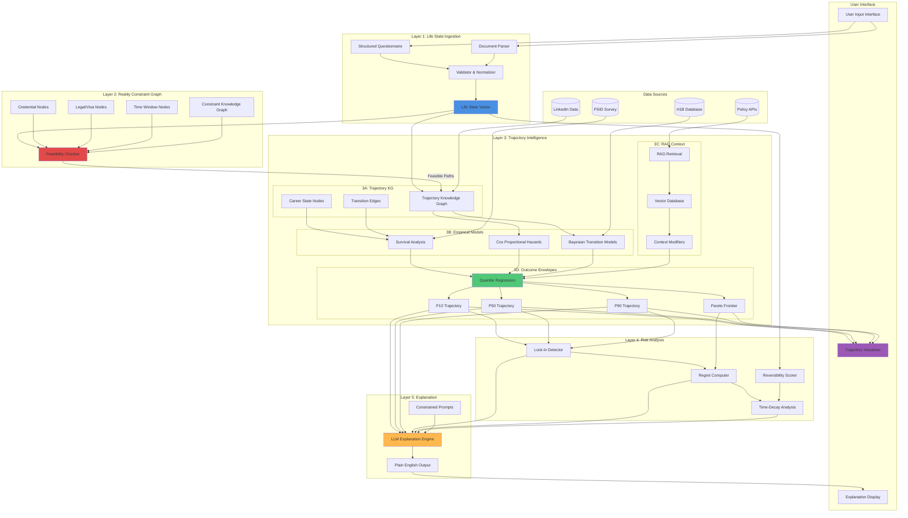

---

## 2. Layer 1: Life State Ingestion - Detailed Flow

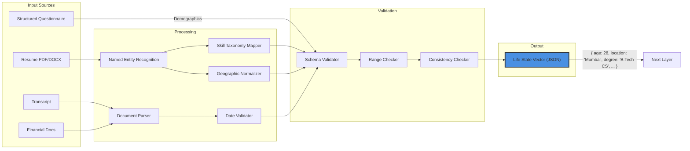

**Life State Vector Schema:**

```json
{
  "demographics": {
    "age": 28,
    "location": "Mumbai, India",
    "citizenship": ["India"],
    "visa_status": {
      "US": {"type": "F1", "expiry": "2027-06-30"}
    }
  },
  "education": [
    {
      "degree": "B.Tech",
      "field": "Computer Science",
      "institution": "IIT Delhi",
      "gpa": 3.7,
      "graduation_year": 2020
    }
  ],
  "career": {
    "current_role": "Software Engineer L3",
    "company": "TCS",
    "industry": "IT Services",
    "years_experience": 3,
    "skills": ["Python", "React", "AWS"],
    "certifications": ["AWS Solutions Architect"]
  },
  "financial": {
    "savings_usd": 15000,
    "debt_usd": 0,
    "annual_income_usd": 25000,
    "equity": 0
  },
  "constraints": {
    "dependents": 0,
    "health_issues": [],
    "geographic_restrictions": [],
    "risk_tolerance": 0.7
  }
}
```

---

## 3. Layer 2: Reality Constraint Graph - Structure & Checking

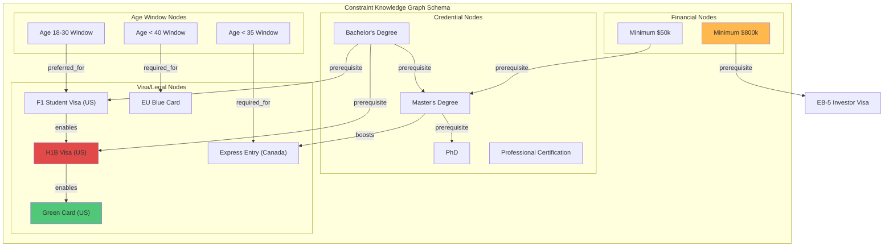

**Feasibility Checking Algorithm:**

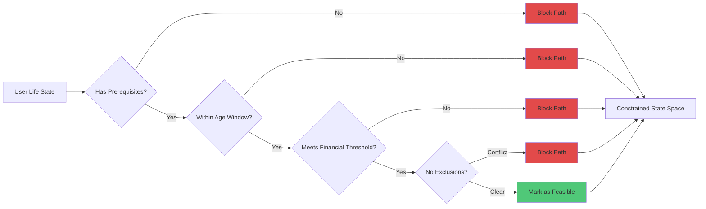

---

## 4. Layer 3A: Trajectory Knowledge Graph

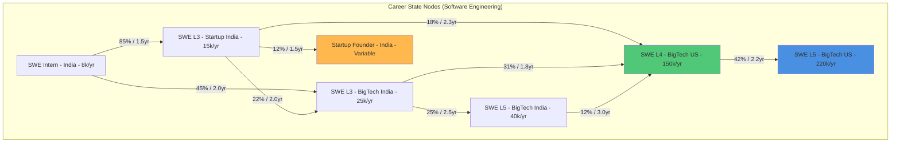

**Edge Metadata Example:**

```json
{
  "from": "SWE_L3_Startup_India",
  "to": "SWE_L4_BigTech_US",
  "observations": 237,
  "success_rate": 0.18,
  "time_to_transition": {
    "P10": 1.2,
    "P50": 2.3,
    "P90": 4.5
  },
  "typical_requirements": [
    "Apply to FAANG",
    "Leetcode preparation",
    "H1B sponsorship",
    "Relocate to US"
  ],
  "financial_cost": {
    "median": 5000,
    "range": [2000, 15000]
  }
}
```

---

## 5. Layer 3B: Empirical Transition Models - Analysis Pipeline

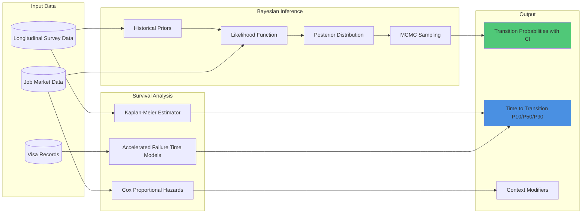

**Survival Analysis Output Example:**

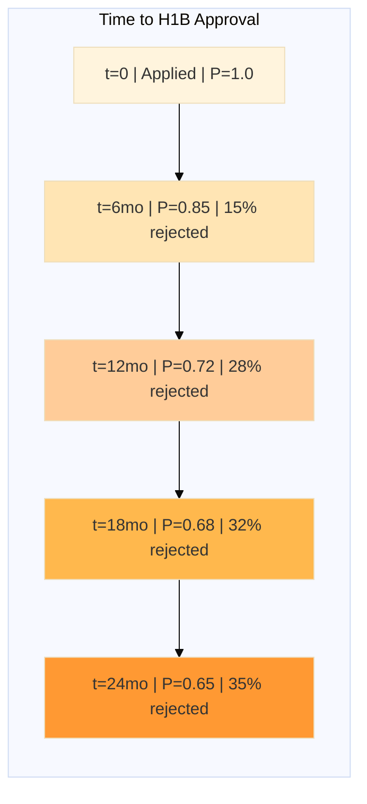

---

## 6. Layer 3C: RAG-Augmented Context Modulation

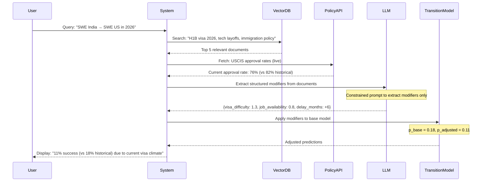

**RAG Modifier Application:**

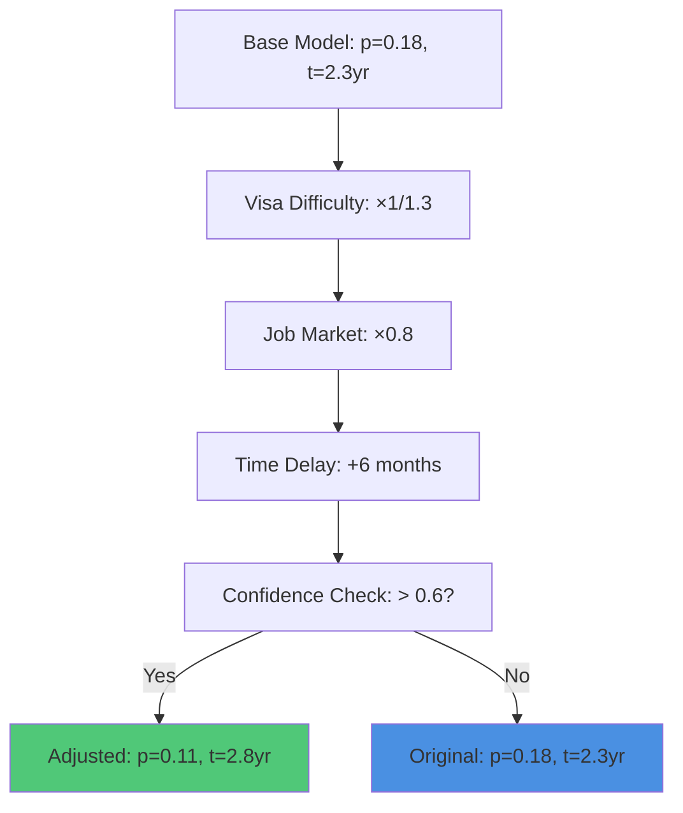

---

## 7. Layer 3D: Deterministic Outcome Envelopes

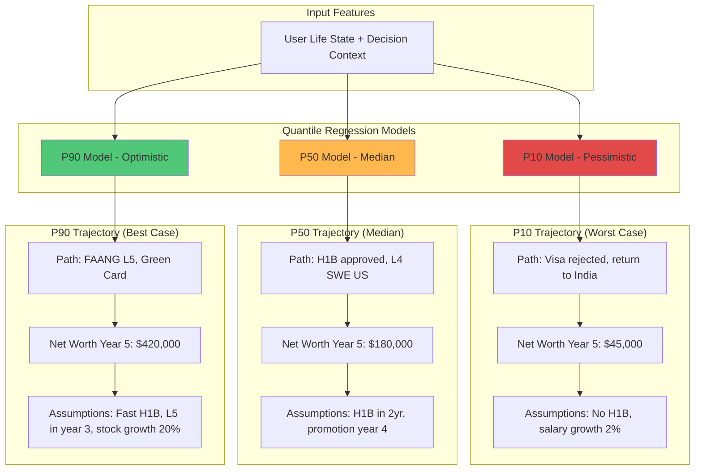

**Pareto Frontier for Multi-Objective Decisions:**

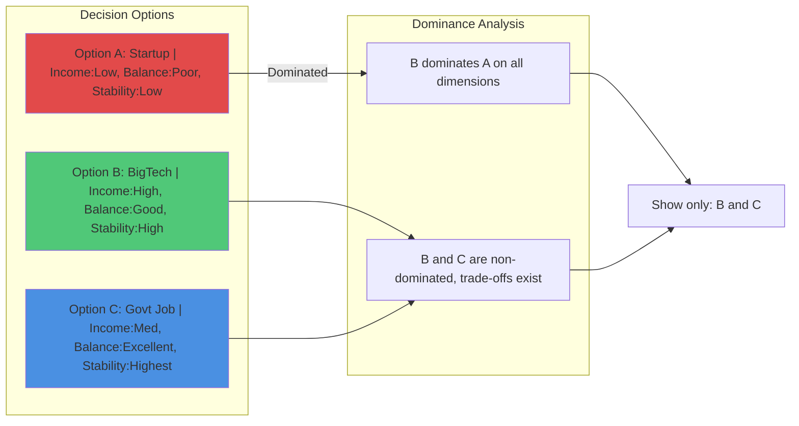

---

## 8. Layer 4: Risk, Regret & Lock-In Analysis

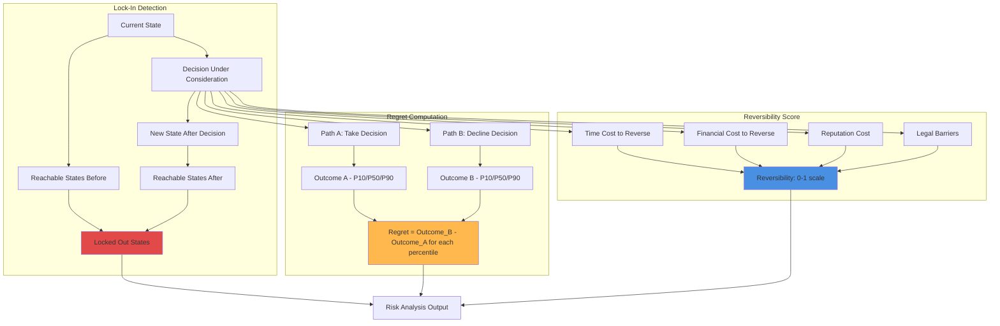

**Time-Decay Regret Analysis:**

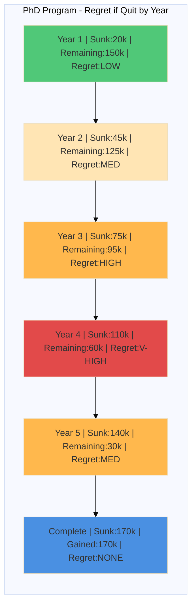

---

## 9. Layer 5: LLM Explanation Pipeline

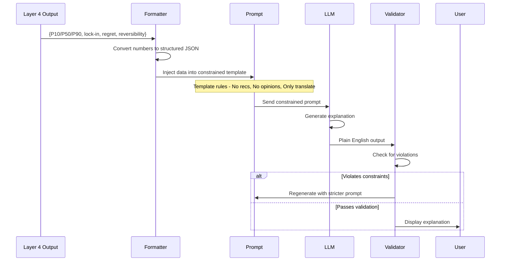

**Constrained Prompt Template:**

```
SYSTEM:
You are an explanation engine for a life decision analysis system.
You translate numerical predictions into plain English.

STRICT RULES:
1. DO NOT recommend actions ("you should do X")
2. DO NOT add your own analysis
3. DO NOT generate new probabilities
4. DO NOT use "I think" or "in my opinion"
5. ONLY explain the numbers provided

INPUT DATA:
{
  "P10": {"net_worth": 45000, "path": "Visa rejected"},
  "P50": {"net_worth": 180000, "path": "H1B approved, L4 SWE"},
  "P90": {"net_worth": 420000, "path": "FAANG L5, Green Card"},
  "lock_in": ["Indian startup founder", "early retirement"],
  "regret_if_decline": {"P50": 120000, "P90": 350000},
  "reversibility": 0.3
}

OUTPUT FORMAT:
- Use headers and bullet points
- Explain probabilities as "1 in 10 chance" not "10%"
- Cite data sources
```

---

## 10. Complete Data Flow: End-to-End

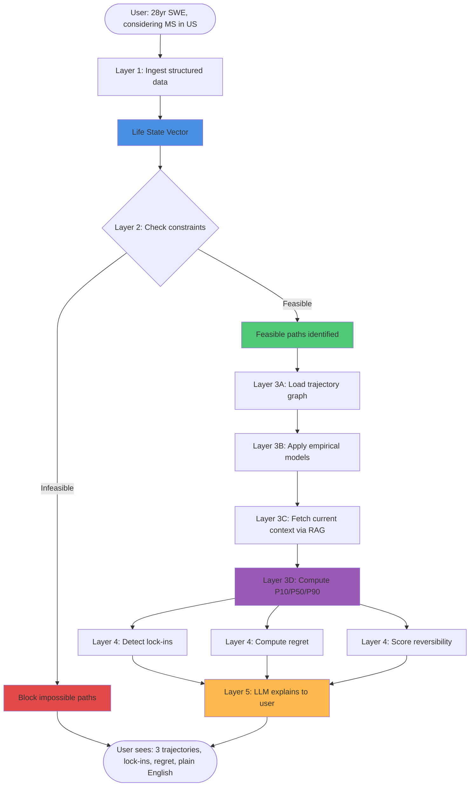

---

## 11. MVP Hackathon Architecture (3-Month Build)

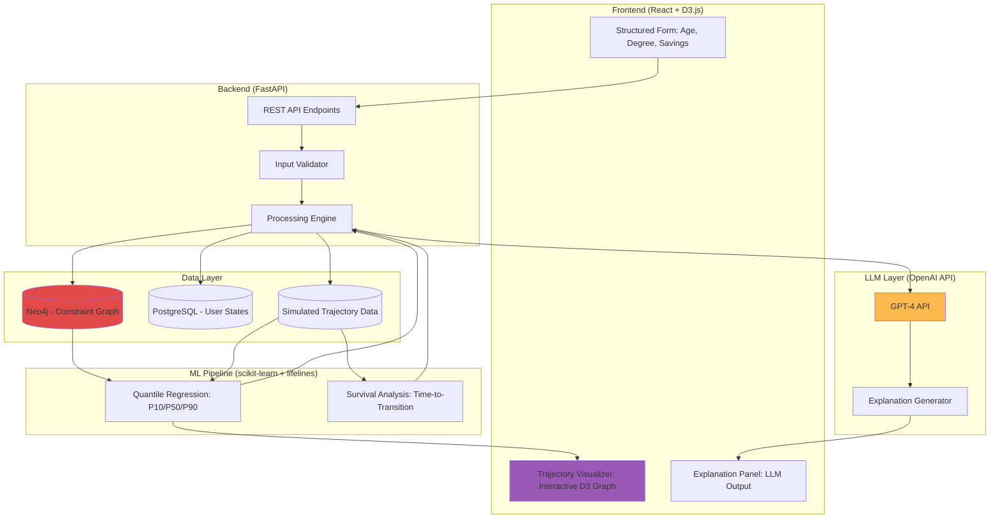

---

## 12. Production System Architecture (2-Year Build)

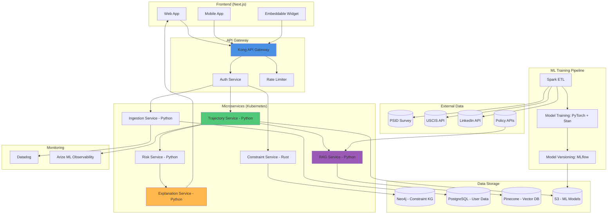

---

## 13. Decision Comparison Flow (Side-by-Side Analysis)

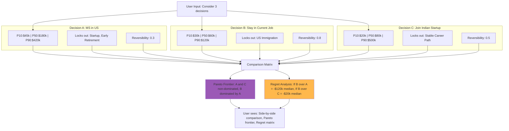

---

## 14. Real-Time RAG Integration Flow

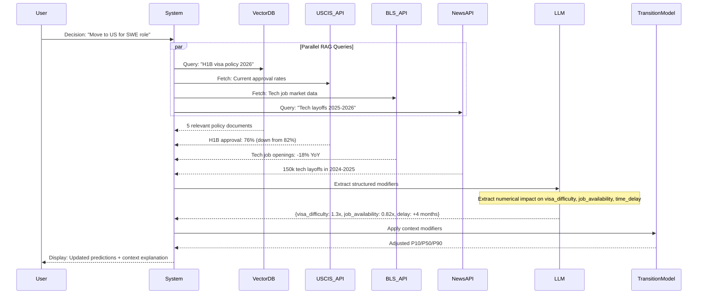

---

## Summary: Key Architectural Principles

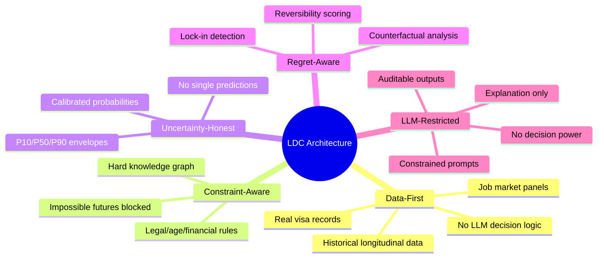

---

> [!IMPORTANT]
> **For Hackathon Demo**: Focus on visualizing the complete flow (#10), MVP architecture (#11), and side-by-side decision comparison (#13). These flowcharts directly demonstrate the system's unique value proposition.

> [!TIP]
> **Technical Depth Signal**: Show judges flowcharts #5 (Survival Analysis), #6 (RAG Integration), and #8 (Risk Analysis) to prove this is not a simple chatbot wrapper.
